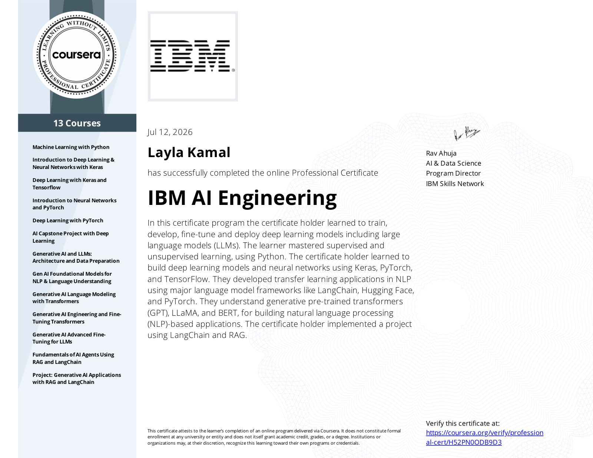
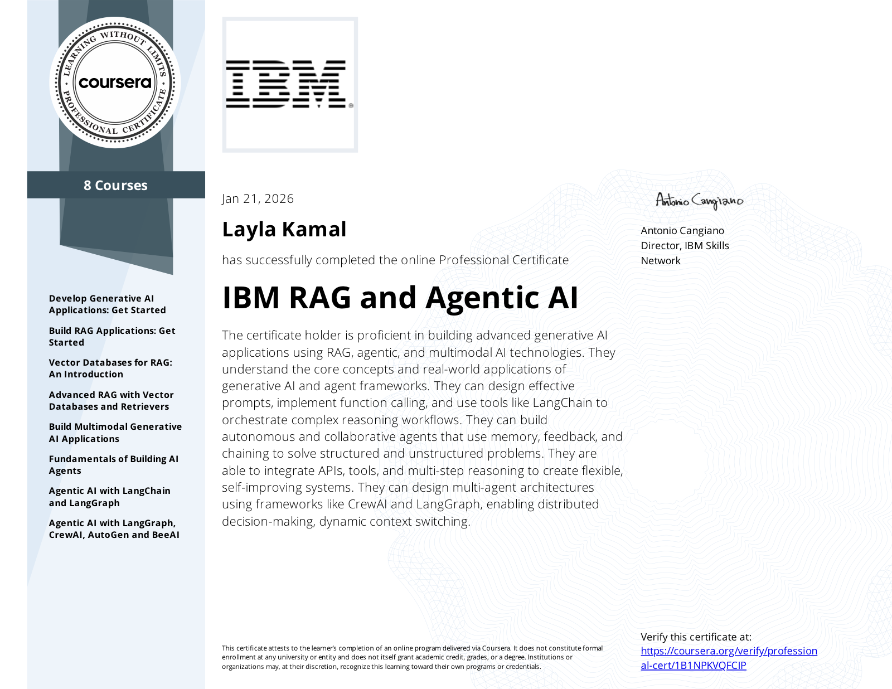
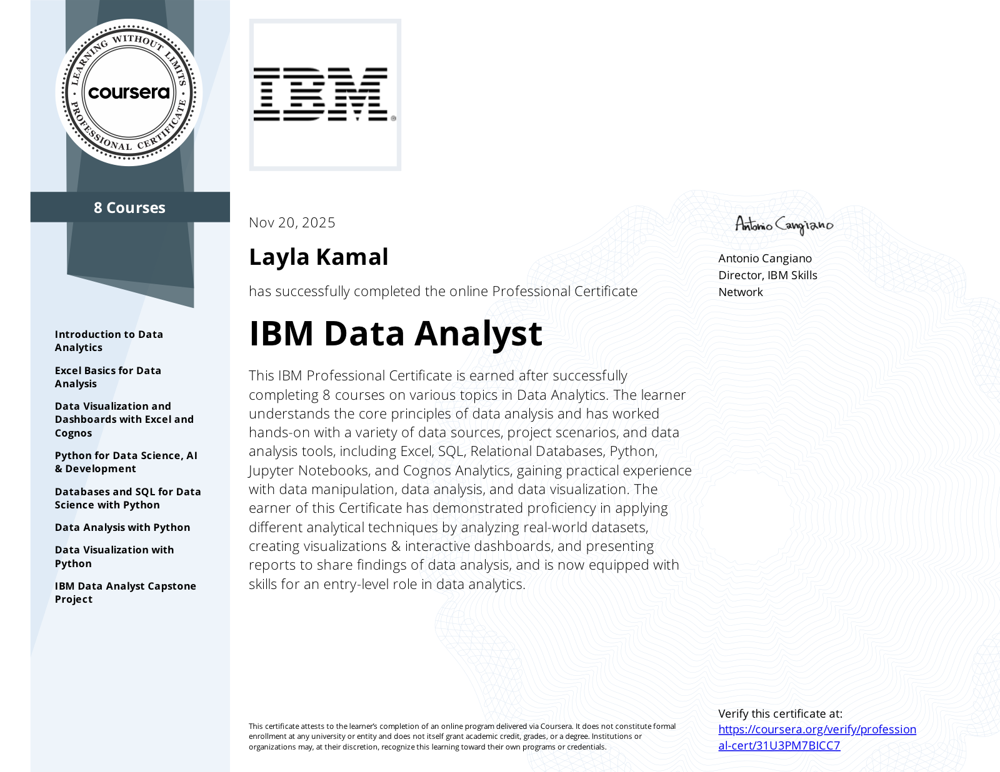

## 🧠 Who am I?

Hi 👋 I'm **Layla Kamal**, an **AI & Data Science Developer**.

- 🎓 Studying **Computer Science**
- 🤖 I focus on **Artificial Intelligence**, **Machine Learning**, **Data Analysis**, and **Generative AI**
- 🛠️ My stack: **Python**, **Flask**, **TensorFlow**, **PyTorch**, **SQL**, and **LangChain**
- 📜 Certified in **IBM AI Engineering**, **IBM RAG and Agentic AI**, and **IBM Data Analyst**
- 🚀 I build AI applications, NLP systems, and data-driven solutions
- 💡 Mindset: *Learn deeply. Build practically. Keep growing.*

---

## 🔗 Connect with Me

&nbsp;&nbsp;

&nbsp;&nbsp;

---

## 🛠️ Tech Stack

### AI & Data

### Development

---

## 🎓 Certifications

  
  &nbsp;&nbsp;
  
  &nbsp;&nbsp;
  

---

## 🌟 Soft Skills

- 🎯 Problem-Solving & Critical Thinking
- 🧑‍🤝‍🧑 Teamwork & Collaboration
- 💡 Creativity & Innovation
- 📅 Time Management & Organization
- 🎙️ Communication & Presentation
- 📈 Continuous Learning

---

**"Learn deeply. Build practically. Keep growing."**
